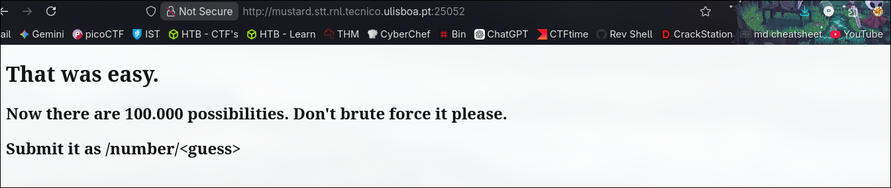

-----------


## Description

Now there are 100,000 possibilities. Don't try to brute force it please...

`http://mustard.stt.rnl.tecnico.ulisboa.pt:25052`

---

Visiting the website, I got this.



This challenge is similar to "Guess a Number" but this time I have **100,000 possibilities**.

This will make things harder because, this time, 100,000 possibilities make a difference when **brute forcing**.

Trying a random number, I got this text saying "Higher!".


Let's try another number.


Ok, now I got "Lower!".

Looks like the website is **giving hints** about whether the number is **lower or higher**. This is great because we can just **brute force** again but with **some rules**. For this we need two variables, **higher and lower** (initially, higher will be 100,000 and lower 0).

1. If it says **lower**, the **number that I tried to guess becomes the higher**.
2. If it says **higher**, the **number that I tried to guess becomes the lower**.
3. The **next guessed number** will be the **difference between the higher and lower, divided by 2**.

I wrote this script to automate the whole process.
 


## FLAG
```flag
SSof{A_little_scripting_is_all_you_need}
```


----
## Conclusion

Because I had **100,000 possibilities**, just **brute forcing** wouldn't be the best option for this challenge, so I had to **add some rules** to it.
The **vulnerable endpoint** is still `/number/{guess}`.
