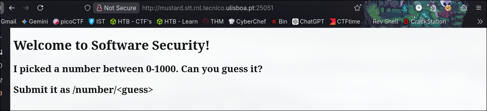
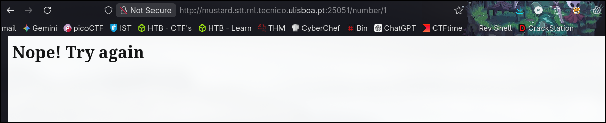
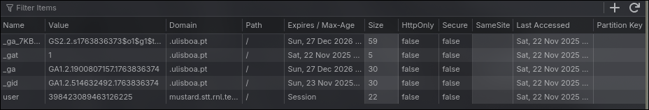
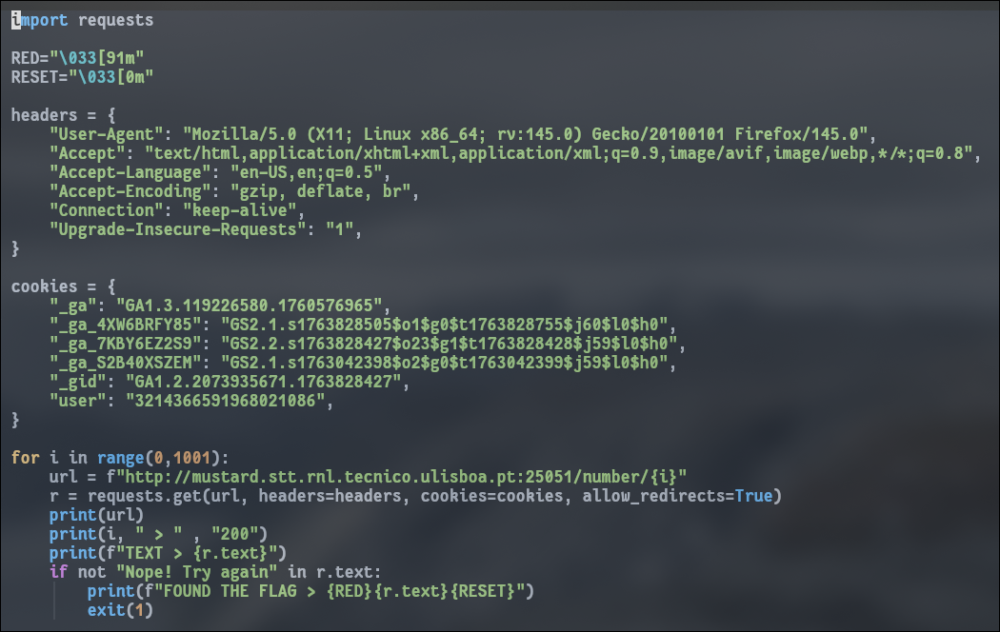

----

Description

I picked a number between 0-1000. Can you guess it?

`http://mustard.stt.rnl.tecnico.ulisboa.pt:25051`

---

When I visited the website, I saw a short description with our objective.



Our goal is to **guess the number between 0-1000**.

Guessing a **random number**, we see that it **displays "Nope! Try again".**



Since I know **what text is displayed** when I get the **number wrong**, I can write a Python script to make all 1001 requests and stop whenever I get the right number, basically **brute forcing** all possible numbers.

This approach **can be expensive** in general, but with only **1001 possibilities** the **search space is small enough** to brute-force comfortably.

Before doing that, I checked the cookies that the website gave me.



I got a **user cookie** that I will use in my script (and some headers just because).

After some time, I wrote this script to make all 1001 requests and get the flag.



After 880 tries, I got the flag.


## FLAG
```flag
SSof{Do_you_master_ZAP_or_still_a_long_way_to_go}
```

----

## Conclusions

This was a **brute-force challenge** against the `/number/{guess}` endpoint.  
Once again, **brute forcing can be resource-intensive** and even **lead to DoS** if abused, but in this case, with only 1001 requests, the impact is minimal and not dangerous at all.
