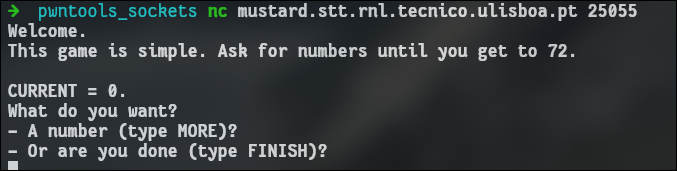
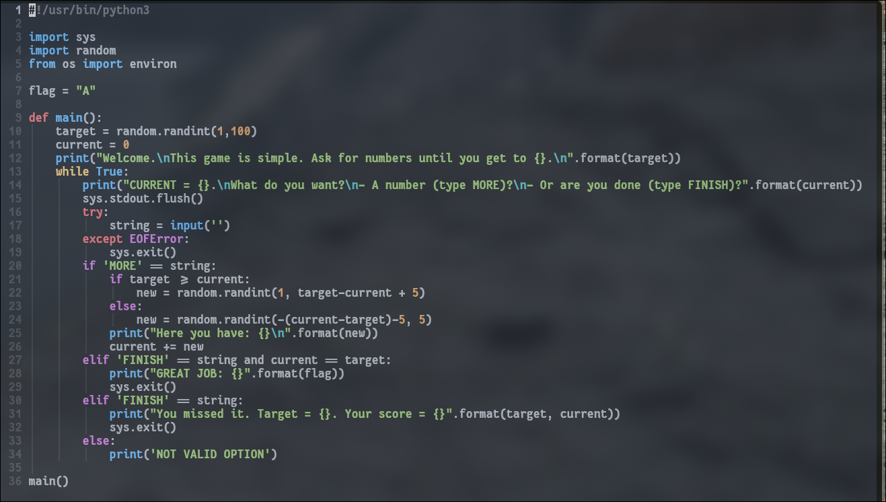
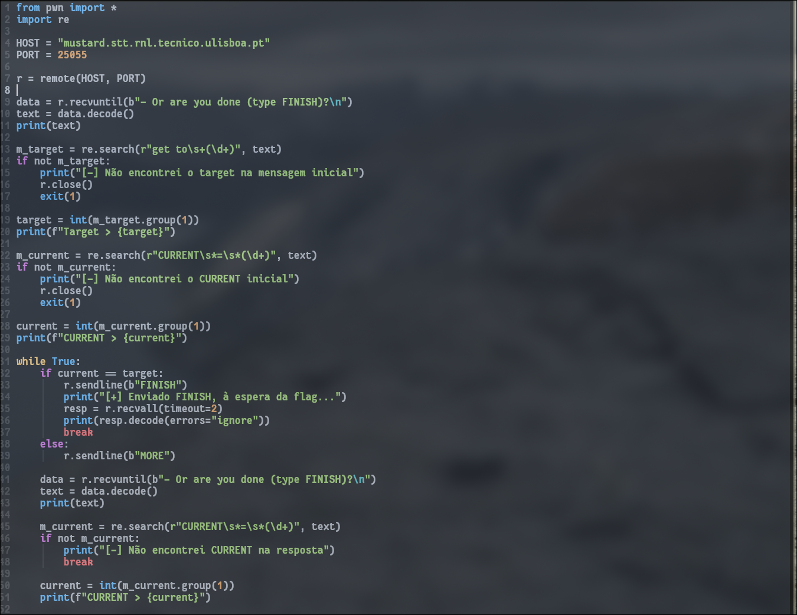
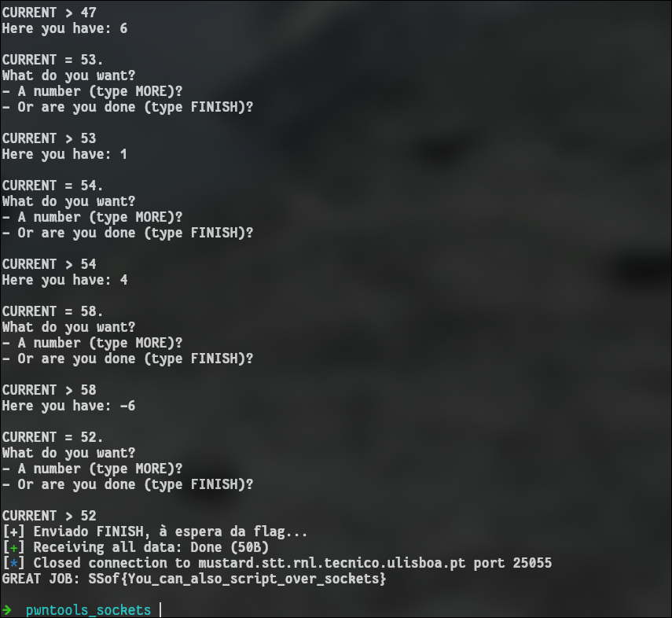

---------

Can you play this game? Just finish once you reach the target.

`nc mustard.stt.rnl.tecnico.ulisboa.pt 25055`

--------

Connecting to the port, I got this:



The challenge also provided the **source code**.


This script basically does the following:

1. Gets a **random number**.
2. Prints the instructions.
3. **Asks the user for a number** or to quit the game.
4. **Loops** forever, until the **user gets the number right** and finishes the game.

Once again we can **brute force**, but this time using the **pwn library** instead of **requests**.

I wrote this script which does the following:



1. Connects to the host.
2. Searches for the target number using regex.
3. Loops until I send the right number using the MORE command.
4. If target == current, I send a FINISH command to receive the flag.



## FLAG

```flag
SSof{You_can_also_script_over_sockets}
```

-----

## Conclusions

In this challenge, I again relied on **brute forcing**, but this time I automated the interaction using **pwntools**.
