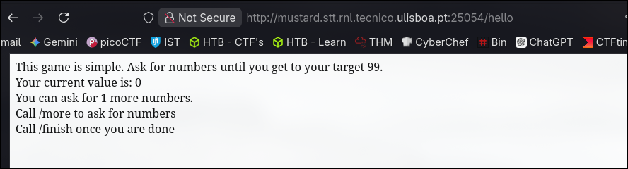
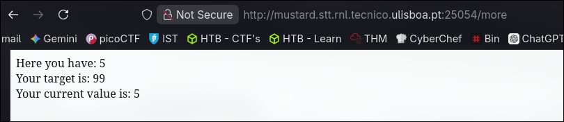
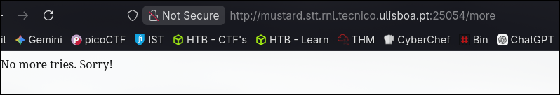
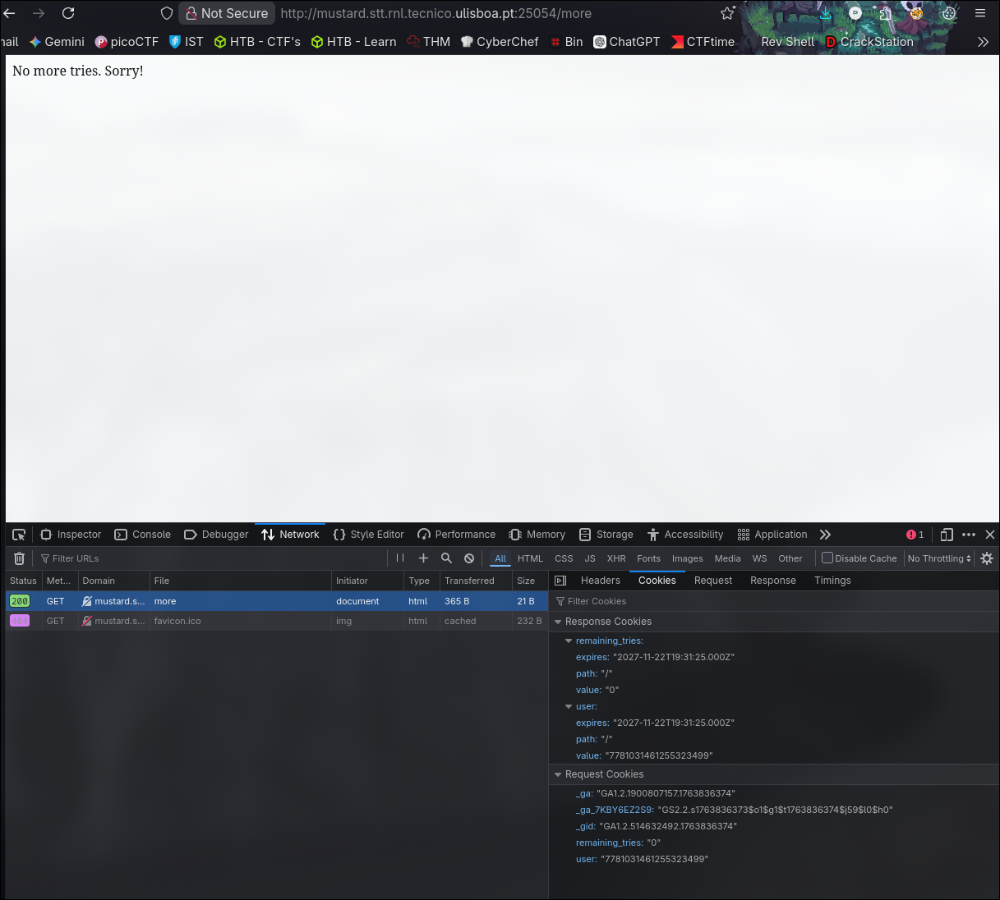
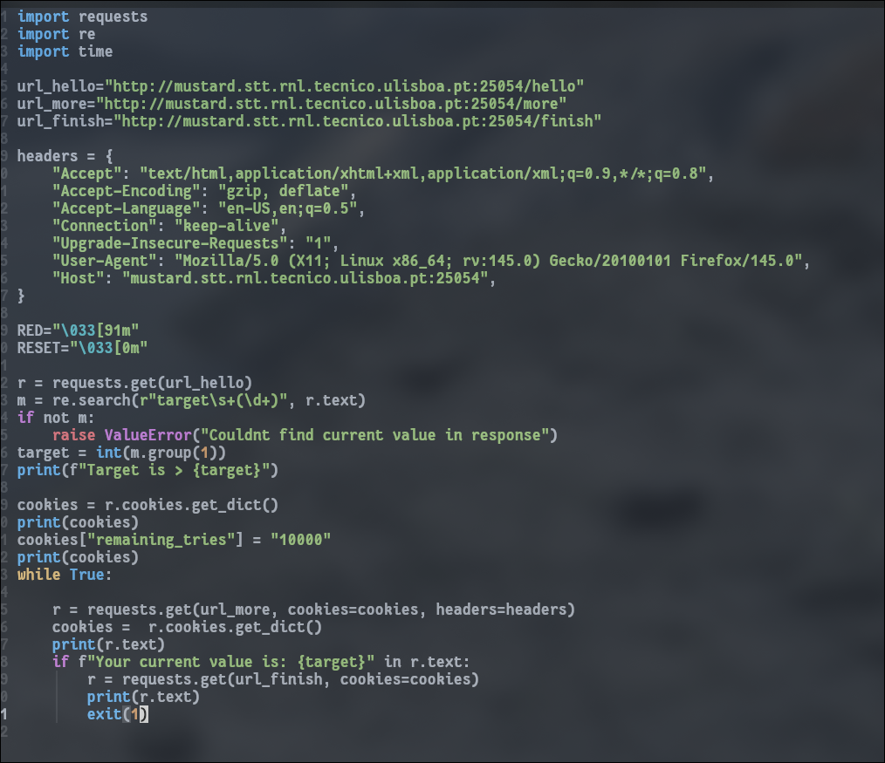
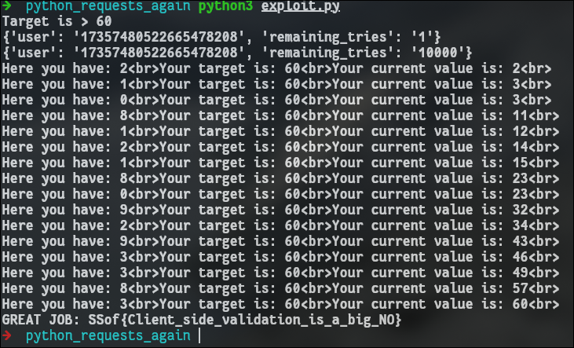

---

Description

Can you win the game again? Now in a single try. Or maybe not...

`http://mustard.stt.rnl.tecnico.ulisboa.pt:25054`

---

Visiting the website, I got this.



This challenge is **similar** to the **"Python requests"** one, but this time we only have **"one" opportunity**.

I checked the same endpoint (/more).



Calling it again shows us this.



Ok, so I just **have "one" try**. **But how does the server know that?**

I **checked** the **request made** to see if there was something important.



I saw that I was **sending a cookie saying I had 0 "remaining tries"**.
**What if I wanted more than that?**

It's possible to **change that field on our request, making the server think we have more tries** than it was originally given.

I made this script to do exactly that.
Basically it **changes the value of "remaining_tries" and sets it to 10000**.
So **next time we call /more**, the server **decrements one from my tries**.



Running it:



## FLAG

```flag
SSof{Client_side_validation_is_a_big_NO}
```

---

## Conclusions

This time I combined **cookie tampering** with **brute forcing**.  
The vulnerability was that the **server blindly trusted the `remaining_tries` cookie** instead of **enforcing the limit on the server side**.
