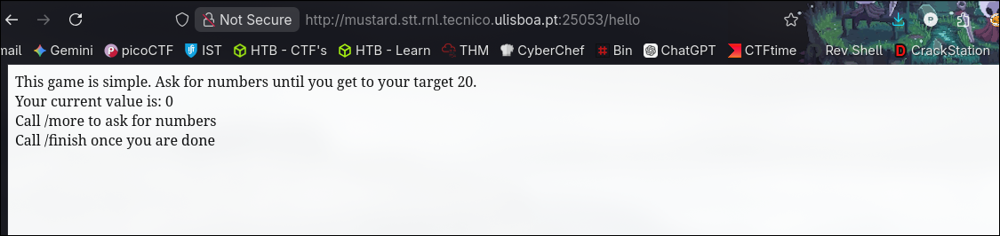
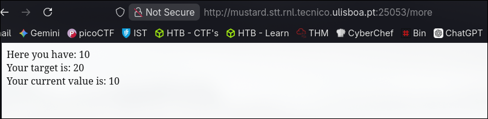
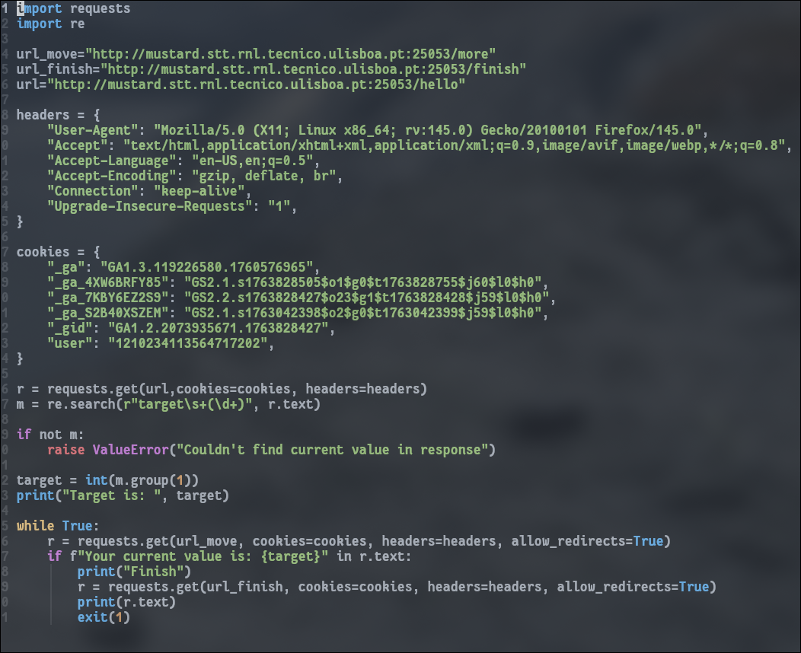

-----------

## Description

Can you play this game? Just finish once you reach the target.

`http://mustard.stt.rnl.tecnico.ulisboa.pt:25053`

---------

Visiting the website, it gives us some text explaining the game.



The game is indeed simple.

It has some rules:
1. I have to **get to my target**.
2. I have to **call /more to ask for random numbers**.
3. When I get the **target number**, I have to **call /finish**.



When I tried to call **/more**, I indeed got **another number**.

Since there's no **brute force rule**, I can just make a script that **calls the /more endpoint** until I get the **target number**.

For that I used **regex** to find the **target number and my current value**.



Running the script gave me the flag.


## FLAG
```flag
SSof{Learning_python_requests_is_a_good_complement_to_ZAP}
```

----
## Conclusions

In this challenge, we can also **brute force** until we get the right number.
The **vulnerable endpoint** is `/more`, which lets me make as many requests as I want.
