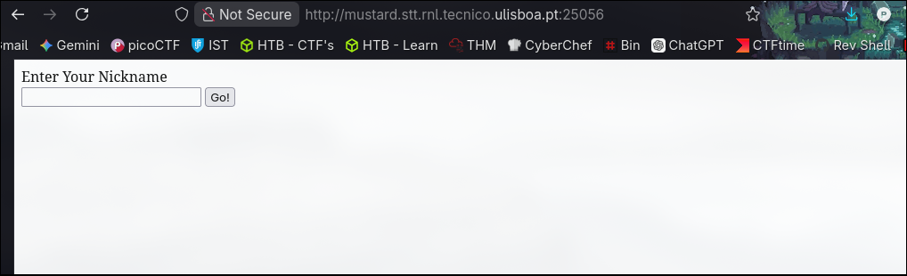
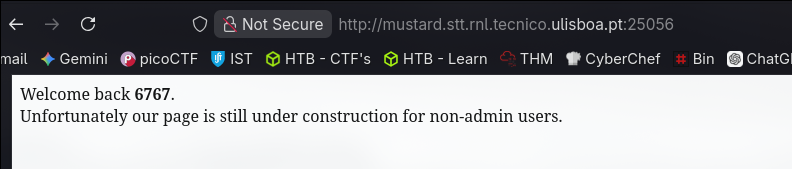
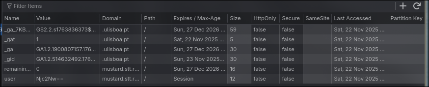
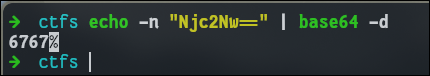
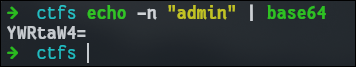
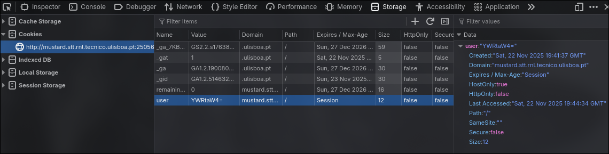
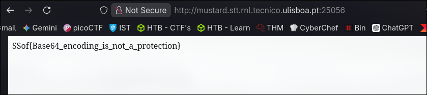

---

Description

We are still working on the content, but this application is secure by design.

`http://mustard.stt.rnl.tecnico.ulisboa.pt:25056`

---

Taking a look at the website, we see that we have an **input field**.



I first thought of **XSS**, but let's first put a **random string**.



Ok, I just got a greeting message, nothing more.

Let's try again.

I had to remove my cookies to try again, but while doing that I noticed the **cookie "user" was encoded in base64**.



**Decoding it, we get "6767"**, which was my input.



What if I **changed the cookie to the encoded version of "admin"**, since I'm not an admin?



Changing the **user cookie** with the **new value** and **refreshing the website**, I managed to get the flag.





## FLAG
```flag
SSof{Base64_encoding_is_not_a_protection}
```

---

## Conclusions

In this challenge I exploited a **cookie-based privilege escalation**: the **challenge trusted a client-side `admin` cookie** to **decide the user's role**. By **encoding my own `admin` cookie** and sending it with the request, the **server incorrectly assumed I was an admin**.
