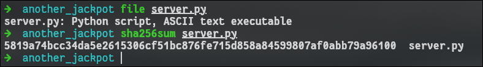
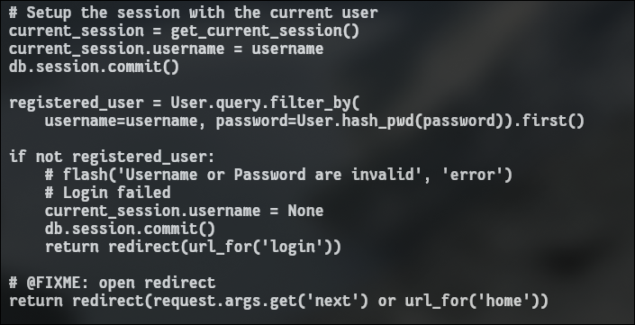
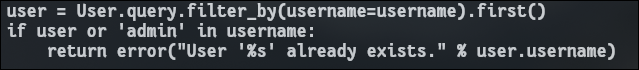
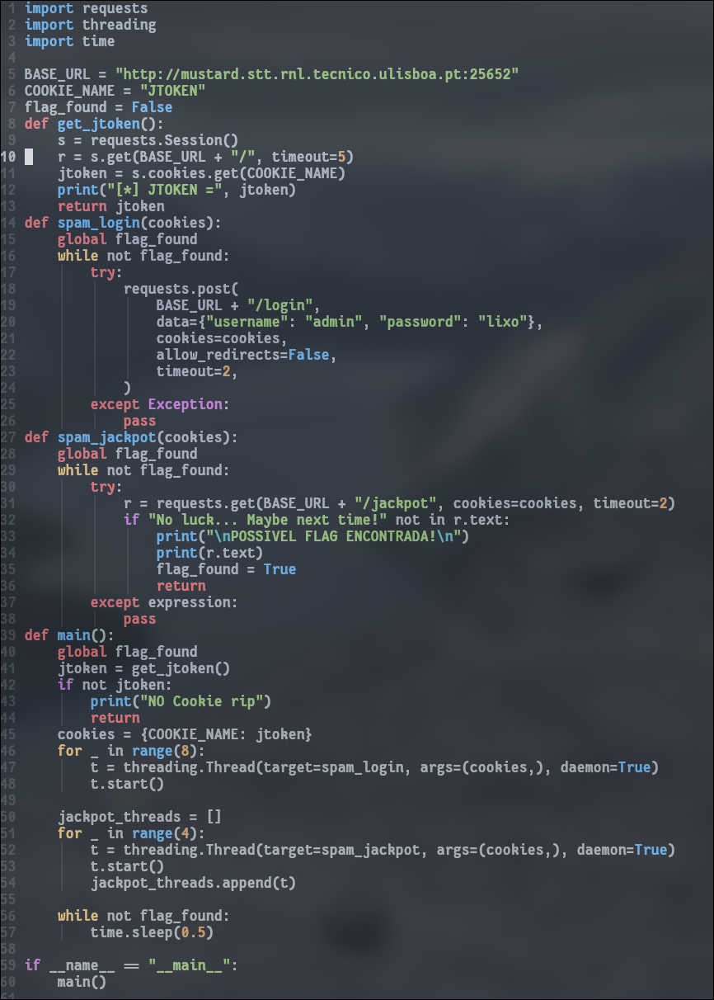
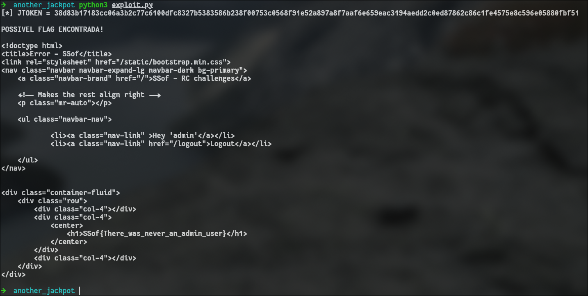

---

## Description

Why does only the `admin` get the jackpot? This is so wrong...

We got our hands on part of the source code `server.py`.

`http://mustard.stt.rnl.tecnico.ulisboa.pt:25652`

_Remark:_ It might be useful to script your solution using Python requests.

---

This challenge has one file:



Contents of server.py
```server.py
from flask import Flask, request, redirect, url_for, make_response, render_template
from flask_sqlalchemy import SQLAlchemy
from functools import wraps
from os.path import isfile
from os import environ, urandom
from sys import argv
import hashlib

# Setup app
app = Flask(__name__)
COOKIE_TOKEN = "JTOKEN"

# Setup db
db_path = "/tmp/flask_server.db"
app.config["SQLALCHEMY_DATABASE_URI"] = 'sqlite:///%s' % (db_path)
app.config["SQLALCHEMY_TRACK_MODIFICATIONS"] = False
db = SQLAlchemy(app)

# Read the flag
FLAG = environ['flag']


def error(msg):
    return render_template('error_response.html', msg=msg)


# ================
# === SESSIONS ===
# ================
class Session(db.Model):
    """
    Associates a session token with its respective user
    """
    id = db.Column(db.Integer, primary_key=True)
    # @FIXME: Should be a Foreign Key, but oh well
    jtoken = db.Column(db.Text(), unique=True)
    username = db.Column(db.Text())

    def __init__(self, username=None):
        self.jtoken = urandom(64).hex()
        self.username = username

    def __repr__(self):
        return '<Session %s>' % (self.jtoken)


def get_current_session(jtoken=None):
    if not jtoken:
        jtoken = request.cookies.get(COOKIE_TOKEN)
        if not jtoken:
            print("[WARNING] This should never happen")
            return None

    return Session.query.filter_by(jtoken=jtoken).first()


@app.context_processor
def templates_utility():
    return dict(get_current_session=get_current_session)


# Runs before every request
@app.before_request
def setup_session():
    def add_session_and_redirect():
        new_session = Session()
        db.session.add(new_session)
        db.session.commit()

        response = make_response(redirect(request.path))
        response.set_cookie(COOKIE_TOKEN, new_session.jtoken)
        return response

    if COOKIE_TOKEN not in request.cookies:
        return add_session_and_redirect()

    current_session = get_current_session()
    if current_session is None:
        return add_session_and_redirect()


def login_required(func):
    @wraps(func)
    def decorated_function(*args, **kwargs):
        current_session = get_current_session()
        if not current_session or current_session.username is None:
            return redirect(url_for('login'))
        else:
            return func(*args, **kwargs)
    return decorated_function


# =============
# === Users ===
# =============
class User(db.Model):
    id = db.Column(db.Integer, primary_key=True)
    username = db.Column(db.Text(), unique=True)
    password = db.Column(db.Text())

    def __init__(self, username, password):
        self.username = username
        self.password = self.hash_pwd(password)

    def __repr__(self):
        return '<User %s>' % (self.username)

    @staticmethod
    def hash_pwd(pwd):
        return hashlib.sha512(pwd.encode()).hexdigest()


# =============
# === VIEWS ===
# =============
@app.route('/')
def home():
    return render_template('home.html')


@app.route('/jackpot', methods=['GET'])
@login_required
def jackpot():
    current_session = get_current_session()

    if current_session.username == 'admin':
        msg = FLAG
    else:
        msg = "No luck... Maybe next time!"

    return render_template('jackpot.html', msg=msg)


@app.route('/register', methods=['GET', 'POST'])
def register():
    if request.method == 'GET':
        return render_template('register.html')

    username = request.form['username']
    password = request.form['password']
    if not username or not password:
        return error("You need to provide the 'username' and 'password' to register.")
    
    user = User.query.filter_by(username=username).first()
    if user or 'admin' in username:
        return error("User '%s' already exists." % user.username)

    user = User(username, password)
    db.session.add(user)
    db.session.commit()

    return redirect(url_for('login'))


@app.route('/login', methods=['GET', 'POST'])
def login():
    if request.method == 'GET':
        return render_template('login.html')

    username = request.form['username']
    password = request.form['password']
    if not username or not password:
        return error("You need to provide a 'username' and 'password' to login.")

    # Setup the session with the current user
    current_session = get_current_session()
    current_session.username = username
    db.session.commit()

    registered_user = User.query.filter_by(
        username=username, password=User.hash_pwd(password)).first()

    if not registered_user:
        # flash('Username or Password are invalid', 'error')
        # Login failed
        current_session.username = None
        db.session.commit()
        return redirect(url_for('login'))

    # @FIXME: open redirect
    return redirect(request.args.get('next') or url_for('home'))


@app.route('/logout')
def logout():
    current_session = get_current_session()

    # Remove the user from the session
    current_session.username = None
    db.session.commit()

    return redirect(url_for('login'))


# ========================
# ========================
# ========================
def main(host):
    if not isfile(db_path):
        db.create_all()

    app.config["DEBUG"] = (host == "127.0.0.1")
    app.run(threaded=True, host=host, port=6660)


if __name__ == '__main__':
    if len(argv) >= 2:
        host = argv[1]
    else:
        host = "127.0.0.1"

    main(host)
```

The server is basically a Flask web app that manages users and sessions. Every visit gets a cookie named **JTOKEN**, which identifies the session.

When I visit the site, the server checks whether I have a JTOKEN cookie:

- If not, a new random session is created and I'm redirected.
    
- If I already have a JTOKEN but it does not match any stored session, a new one is created as well.

The server stores usernames and SHA-512 hashed passwords inside a SQLite database (`/tmp/flask_server.db`).

The interesting part is how login works. When I log in, the server immediately updates my current session and sets `current_session.username = username`, **before verifying the password**.
Only after doing that does it check if the password is correct.  
If the login fails, it resets the username back to `None`, but in the short window between setting the username and checking the password, my session temporarily becomes that username.



The `/jackpot` route gives the flag only if the user's session username is exactly `"admin"`.

I also tried to register as `"admin"` but it is blocked.




But the login vulnerability allows me to set my session to `"admin"` by logging in with a non-existent account and abusing the timing.

Since I just have to create a JTOKEN, pass the admin username, and spam /jackpot to get the flag before the server verifies I'm not the admin, I made a script to exploit this race condition vulnerability.



Basically what it does is:
- Multiple threads **spam `/login`** with username `admin` to temporarily set `session.username = 'admin'` before the password check resets it.
- At the same time, other threads **spam `/jackpot`** using the same JTOKEN, hoping that the server hasn't checked the password yet and the session is still `"admin"`.
- When the timing hits, `/jackpot` returns the **flag** instead of `"No luck... Maybe next time!"`.

Running my script gave me the flag.




## FLAG
```flag
SSof{There_was_never_an_admin_user}
```

---

## Conclusions

This challenge **exploited a race condition** in the **login logic**, where the **session username was set _before_ password validation**.
By **quickly switching between fake admin logins and jackpot** requests **using the same JTOKEN**, it was **possible to become "admin"** and retrieve the flag.
