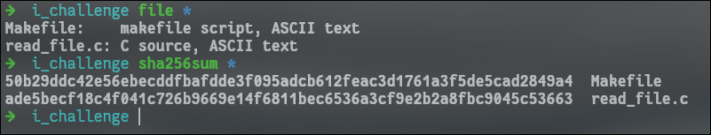
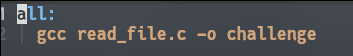
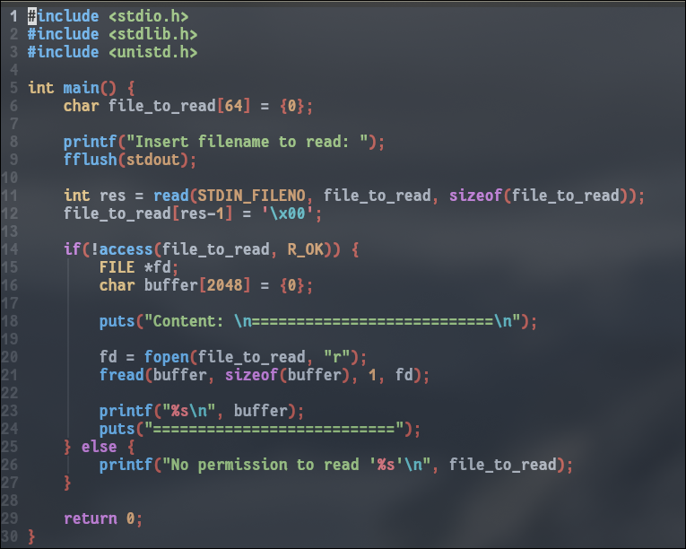
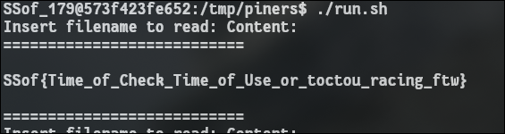

---

## Description

This system is owned by `root` and there is an interesting `flag` in there. Can you get it for me? You can read `/challenge` and you can write on `/tmp`.

`ssh username@mustard.stt.rnl.tecnico.ulisboa.pt -p 25651`

_Remark1_: `username:passwd` are available in Menu > Settings. _Remark2_: Be courteous to others and do not exhaust all the resources of the machine. Also do not forget to kill your solution as soon as you find the flag.

---

This challenge has 2 given files.



Contents of Makefile



Contents of read_file.c



The Makefile is not relevant for this challenge.

The read_file.c basically does the following:
1. **Allocates a 64-byte buffer** to hold my **input filename**.

2. It prints "Insert filename to read:" and flushes the output.

3. It **reads up to 64 bytes** from **stdin**.

4. It replaces the final byte read with a NUL to create a string.

5. It **checks whether the file is readable using `access()`** (**TOCTOU vulnerable**).

6. If **readable**, it **opens the file, reads up to 2048 bytes**, and prints them.

7. If not, it prints a "No permission to read" error.

Because the **program checks permissions (`access()`)** and then later **opens the file (`fopen()`) using the same path**, I can just **replace the file** between those two moments **using a fast symlink swap**.

This was the script I made.
```bash
#!/bin/bash
while true; do
    ln -sf dummy pointer
    echo "pointer" | /challenge/challenge &
    ln -sf /challenge/flag pointer
done
```

This script basically **performs a TOCTOU race** by **quickly switching the `pointer` symlink**.
First it links `pointer` to a file that I created (`dummy`), then it executes the challenge.
The challenge calls `access()` on `pointer` while it still points to `dummy`, so the permission check succeeds.
Almost immediately, the **script swaps the symlink to point at `/challenge/flag`**.
When the program then calls `fopen()`, it **follows the new target of the symlink and ends up opening the flag file**.
Basically, with this script I managed to "win" the race between the **time of check** (`access()`) and the **time of use** (`fopen()`).

---



## FLAG
```flag
SSof{Time_of_Check_Time_of_Use_or_toctou_racing_ftw}
```

## Conclusions

This challenge is vulnerable to TOCTOU because **it checks file permissions with `access()` and later opens the file with `fopen()` without re-validating the path that was inputted**.
