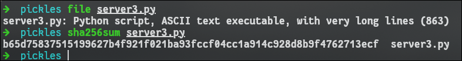
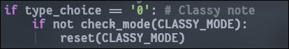
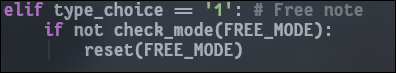
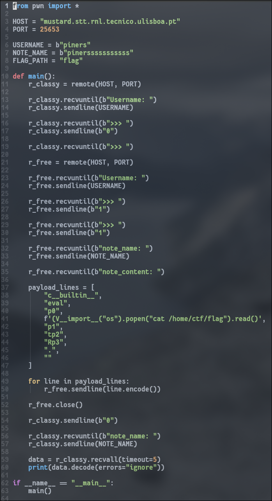
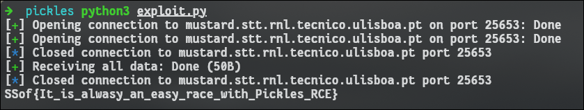

---

## Description

This is a tough challenge for A+ students.

`nc mustard.stt.rnl.tecnico.ulisboa.pt 25653`

---

This challenge has only one file.



Contents of server3.py
```server3.py
#!/usr/bin/env python
import hashlib
import os
import shutil
import pickle


# ===================================================
class Note(object):
    def __init__(self, name, content):
        self.name = name
        self.content = content

    def __str__(self):
        return "Note '%s': %s" % (self.name, self.content)

def sha256(s):
    return hashlib.sha256(s.encode('utf-8')).hexdigest()

CLASSY_MODE = 'CLASSY'
FREE_MODE = 'FREE'
def check_mode(mode):
    try:
        with open(directory + '/mode', 'r') as f:
            return f.read() == mode
    except:
        return False

def set_mode(mode):
    with open(directory + '/mode', 'w') as f:
        f.write(mode)

def reset(mode):
    shutil.rmtree(directory)
    os.makedirs(directory)
    set_mode(mode)
# ===================================================


# Print banner
notes_storage = " _______   ________   ______________________  _________         ____________________________   __________    _____     ________ ___________\n \      \  \_____  \  \__    ___/\_   _____/ /   _____/        /   _____/\__    ___/\_____  \  \______   \  /  _  \   /  _____/ \_   _____/\n /   |   \  /   |   \   |    |    |    __)_  \_____  \         \_____  \   |    |    /   |   \  |       _/ /  /_\  \ /   \  ___  |    __)_ \n/    |    \/    |    \  |    |    |        \ /        \        /        \  |    |   /    |    \ |    |   \/    |    \\    \_\  \ |        \\\n\____|__  /\_______  /  |____|   /_______  //_______  / ______/_______  /  |____|   \_______  / |____|_  /\____|__  / \______  //_______  /\n        \/         \/                    \/         \/ /_____/        \/                    \/         \/         \/         \/         \/ "

print ("1. Ever lost your class notes??")
print ("2. Ever wanted to store notes but had no place to and then forgot everything and failed the exam???")
print ("3. Are you tired of having to carry your notebooks????")
print ("")
print ("If you answered YES, this is the service for you!!")
print (notes_storage)
print ("\n")


# Read username and setup directory
username = input('Username: ')
directory = "/tmp/notes/%s" % sha256(username)
if not os.path.exists(directory):
    os.makedirs(directory)

# Read user choices
type_choice = ""
while type_choice not in ('0', '1'):
    print("Which note type do you want:")
    print("0: Classy note")
    print("1: Free Note")
    type_choice = input('>>> ')

def read_or_write_option():
    action_choice = ""
    while action_choice not in ('0', '1'):
        print("0: Read note")
        print("1: Write Note")
        action_choice = input('>>> ')

    note_name = input('note_name: ')
    note_path = "%s/%s" % (directory, sha256(note_name))
    if action_choice == '0':
        if not os.path.isfile(note_path):
            print("[ERROR] Can't read a file that does not exist")
            exit(-1)
        else:
            with open(note_path, 'rb') as f:
                note_content = f.read()
    elif action_choice == '1':
        note_content = ""
        line = input("note_content: ")
        while line:
            note_content += line + '\n'
            line = input()

    return action_choice, note_path, note_name, note_content


# Main functionality
if type_choice == '0': # Classy note
    if not check_mode(CLASSY_MODE):
        reset(CLASSY_MODE)

    action_choice, note_path, note_name, note_content = read_or_write_option()
    if action_choice == '0': # read
        note = pickle.loads(note_content)
        print(note)
    elif action_choice == '1': # write
        note = Note(note_name, note_content)
        with open(note_path, 'wb') as f:
            pickle.dump(note, f)
    else:
        print("YT0!?")

elif type_choice == '1': # Free note
    if not check_mode(FREE_MODE):
        reset(FREE_MODE)

    action_choice, note_path, _, note_content = read_or_write_option()
    if action_choice == '0': # read
        print(note_content)
    elif action_choice == '1': # write
        with open(note_path, 'wb') as f:
            f.write(note_content.encode('utf8','surrogateescape'))
    else:
        print("HuM!?")
else:
    print("WHaT!?")
```

Some important points about server3.py are:

- The script stores user notes inside `/tmp/notes/<sha256(username)>`, separating them into two modes: **CLASSY** (pickled Python objects) and **FREE** (plain text).

- Notes are saved under a filename derived from `sha256(note_name)`.

- In **CLASSY mode**, notes are serialized/deserialized using `pickle`, allowing arbitrary Python objects (like the `Note` class).

- When switching between modes, the program **deletes the entire user directory**, resetting it to the selected mode.





- The critical vulnerability is that reading a CLASSY note unpickles **attacker-controlled data**, enabling **arbitrary code execution** via malicious pickle payloads.
![[Vuln.png]]

Because `pickle` executes arbitrary Python objects during deserialization, I can craft a malicious payload that runs code when the server unpickles it.


I made this script to do that automatically.



What it does is:
- Opens **two connections** with the _same username_: one in _Classy mode_ and one in _Free mode_.
    
- In the _Free mode_ connection, it **writes a malicious pickle payload** disguised as a normal note.
    
- In the _Classy mode_ connection, it later **reads that note**, causing the server to `pickle.loads()` the malicious payload.
    
- When loaded, the payload runs `os.popen("cat /home/ctf/flag").read()` on the server, returning the flag.

The payload is made of the following:
- `"c__builtin__"` → tells pickle to load a global from module `__builtin__`.
    
- `"eval"` → specifies the global I want: the function `eval`.
    
- `"p0"` → saves this function in pickle's memo slot 0.
    
- `f'(V__import__("os").popen("cat /home/ctf/flag").read()'` → pushes a string that, when evaluated, runs the command and reads the flag.
    
- `"p1"` → saves that string in memo slot 1.
    
- `"tp2"` → builds a tuple `(string,)` — the argument list for `eval`.
    
- `"Rp3"` → calls `eval(string)`, executing the code.
    
- `"."` → stops the pickle stream.

Executing this payload, I successfully got the flag.



## FLAG
```flag
SSof{It_is_alwasy_an_easy_race_with_Pickles_RCE}
```

----

## **Conclusion**

This challenge shows how dangerous insecure deserialization can be. By abusing the server's use of `pickle.loads()` on user input, it's possible to gain full remote code execution and read the flag.
