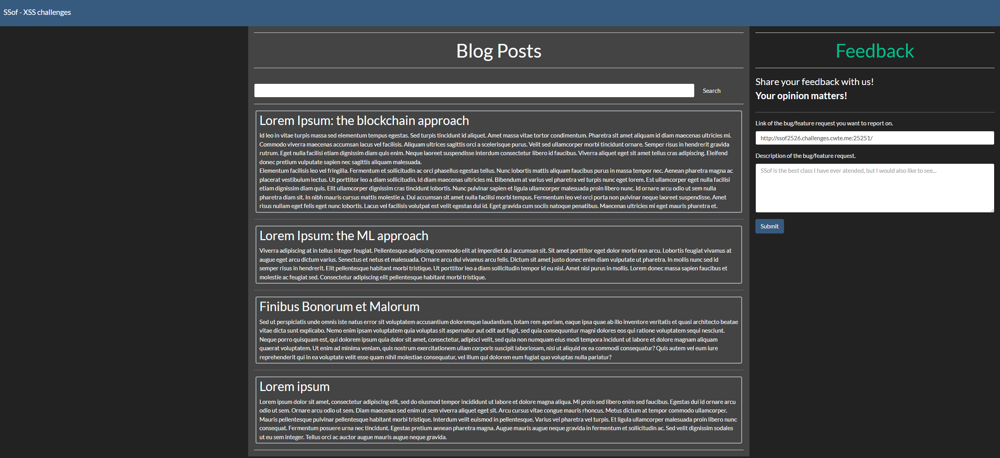

---

## Description

This is just a boring cookie.

`http://ssof2526.challenges.cwte.me:25251`

---

This is the website for the challenge.


Trying a simple XSS on the blog posts input field to get my cookies (even though I could just get them in storage), it's possible to execute JavaScript.

`PAYLOAD`:
```payload
<script>alert(document.cookie);</script>
```


## FLAG
```flag
SSof{USERS_HAVE_NO_SECRETS}
```

---

## Conclusion

This challenge showed how weak input validation can lead to XSS and expose user data. With a simple script it was easy to run JavaScript and access the cookies to obtain the flag (which was the user's cookie).
